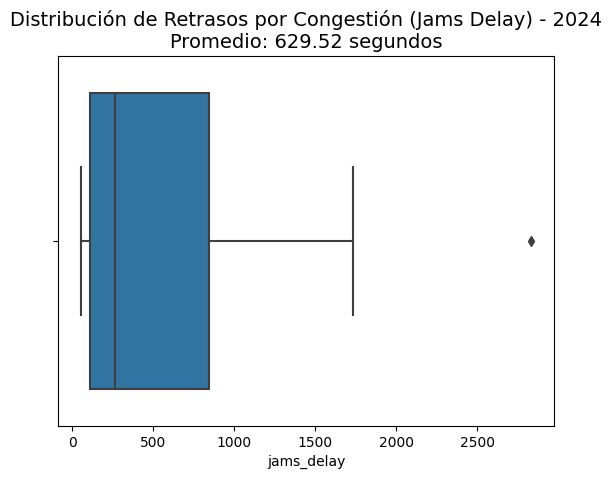

``

# 🚦 Movilidad Urbana vs. Productividad Económica en LATAM

## 🎯 Objetivo del Proyecto
¿Cuánto le cuesta el tráfico a la economía de una ciudad? Este análisis utiliza datos reales de **TomTom Traffic Index** y la **OECD** para evaluar la correlación entre la congestión vehicular y el PIB per cápita en las principales metrópolis de Latinoamérica (Bogotá, Lima, Ciudad de México, entre otras).

## 🛠️ Stack Tecnológico
* **Lenguaje:** Python 🐍
* **Librerías:** Pandas (Manipulación), Matplotlib/Seaborn (Visualización), Scipy (Estadística).
* **Análisis Estadístico:** Coeficiente de Correlación de Pearson.

## 📈 Hallazgos Clave (Insights del Cónclave)

### 1. El Costo del Caos 📉
Se evidenció una **fuerte correlación negativa** estadísticamente significativa: a mayores niveles de congestión prolongada, se observa un estancamiento en el crecimiento del PIB per cápita. El caos vial "devora" la productividad financiera neta.

### 2. El Caso Crítico: Bogotá 🇨🇴
Bogotá demostró tener la correlación más perjudicial. Es la ciudad con niveles de congestión más alarmantes frente a su productividad, lo que la posiciona como la candidata prioritaria para financiamiento de infraestructura masiva (Metro/BRT) por encima de Lima o Buenos Aires.

## 🐍 Python Showcase: Análisis de Correlación
Para validar la hipótesis, se utilizó el siguiente bloque de código para cruzar las métricas de movilidad y economía:

```python
# Cálculo de la Correlación de Pearson
correlation, p_value = stats.pearsonr(df['traffic_index'], df['gdp_per_capita'])
print(f"Correlación de Pearson: {correlation:.2f}")
```

Se utiliza Python para encontrar correlaciones reales entre el caos vial y el dinero (PIB). 

📊 Visualización de Datos
### 📊 Análisis de Correlación: Movilidad vs. Productividad
A través de este diagrama de dispersión, identificamos que existe una correlación negativa significativa. Esto confirma que el aumento en los tiempos de traslado impacta directamente en el PIB per cápita de las ciudades analizadas.



✅ Calidad de los Datos (QA)
Integridad Referencial: Se aseguró que los nombres de las ciudades coincidieran entre las bases de datos de la OECD y TomTom.

Limpieza: Tratamiento de outliers en niveles de congestión para evitar sesgos en el promedio regional.

Autor: David G. Ramos

https://dataanalist-davidgramos.github.io/mi-sitio-web

www.linkedin.com/in/david-g-ramos

Proyecto 5 de Carrera: Data Analytics - TripleTen

